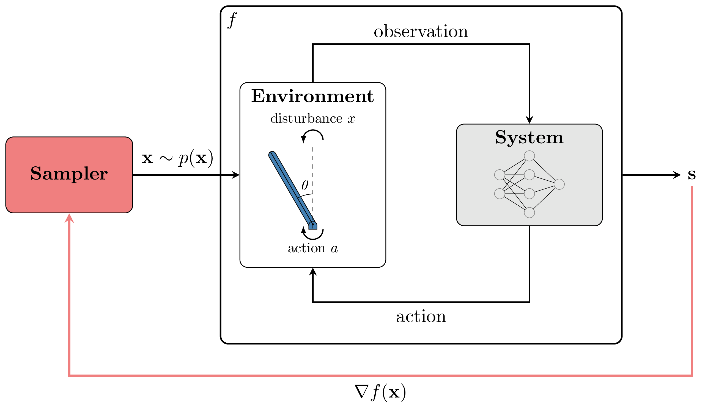
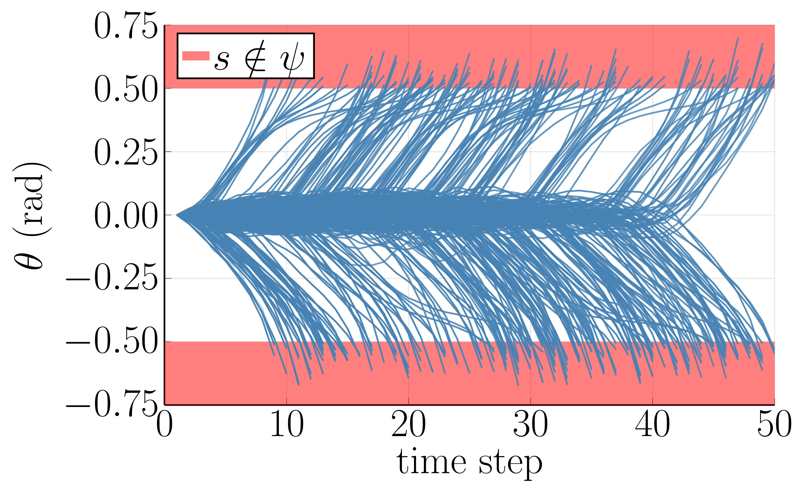

# Model-based Validation as Probabilistic Inference
This is the codebase for the paper "Model-based Validation as Probabilistic Inference" presented at L4DC 2023.

We frame estimating the distribution over failure trajectories for sequential systems as Bayesian inference. Our model-based approach represents the distribution over failure trajectories using rollouts of system dynamics and computes trajectory gradients using automatic differentiation.

<p align="center">
    
</p>

Our method efficiently samples from high-dimensional, multimodal failure distributions using an off-the-shelf implementation of Hamiltonian Monte Carlo. In the example below, we sample failures of a neural network-controlled inverted pendulum with noisy actions. The system fails when the pendulum falls over.


<p align="center">
    
</p>

See our paper for more details and results! (Link coming soon)

## Installation
First, clone this repo
```
$ git clone https://github.com/sisl/ModelBasedValidationInference.git
```

Enter the Julia REPL
```Bash
$ julia
```
Type "]" to enter Pkg mode
```Julia
julia> ]
```

Activate and instantiate the project
```Julia
pkg> activate .
pkg> instantiate
```

Run one of the scripts from the `scripts` directory
```
$ julia --project scripts/run_pendulum.jl
```
